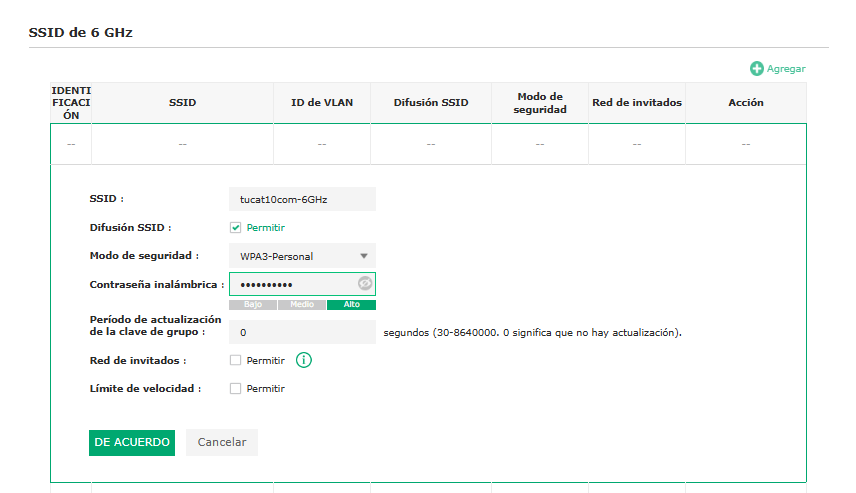
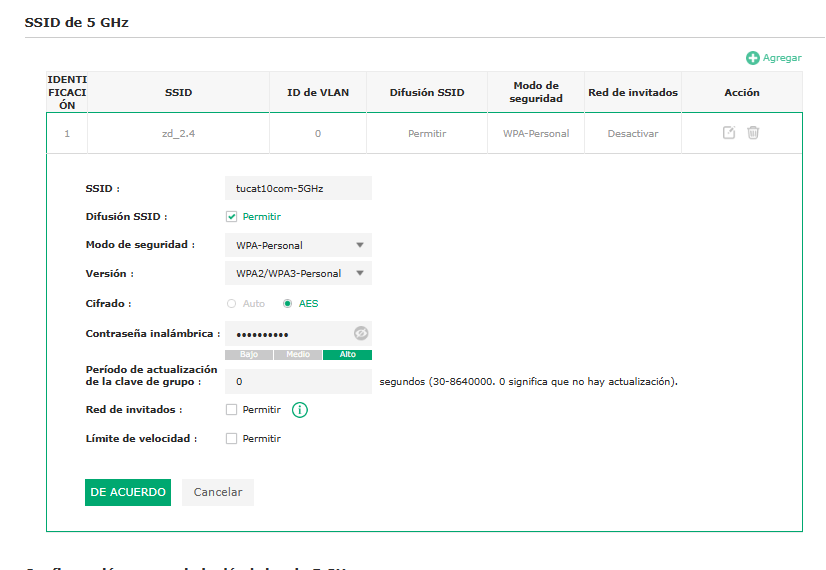
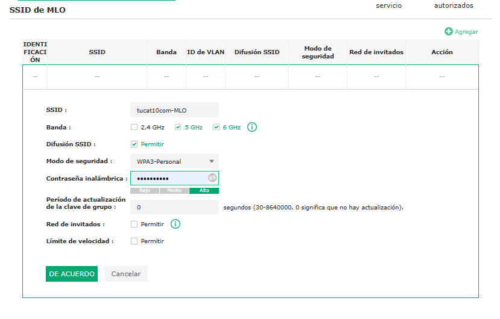
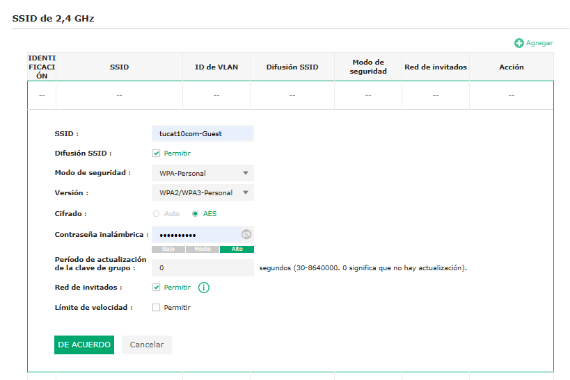

# CONFIGURACIÓN DE RED WI-FI 7

## Empresa: tucat10com

Alumno: Santiago Hernandez  
Fecha: 07/05/2026
Asignatura: Servicios en red.

***

# 1. INTRODUCCIÓN

En esta actividad se ha diseñado y configurado una red inalámbrica basada en tecnología Wi-Fi 7 para la empresa tucat10com, dedicada a la edición de vídeo en alta resolución (8K).

El objetivo principal ha sido crear una infraestructura de red que proporcione alta velocidad, baja latencia y gran capacidad de transmisión de datos, además de una red independiente para invitados que garantice la seguridad de la red interna.

***

# 2. EQUIPAMIENTO UTILIZADO

Para la implementación de la red se han seleccionado puntos de acceso TP-Link Omada EAP772, compatibles con Wi-Fi 7.

Estos dispositivos permiten trabajar en múltiples bandas (2.4 GHz, 5 GHz y 6 GHz) e incorporan la tecnología Multi-Link Operation (MLO), que mejora el rendimiento al combinar varias bandas simultáneamente.

 

***

# 3. PRESUPUESTO

Se han seleccionado 2 puntos de acceso TP-Link Omada EAP772.

Precio unitario: 182 € (Amazon)  
Enlace: <https://www.amazon.es/gp/product/B0D4LM97LW/ref=ox_sc_act_image_1?smid=AMOTOP2RXDRQV&psc=1>  
Cantidad: 2

Coste total: 364 €

Se ha elegido este modelo por su compatibilidad con Wi-Fi 7, su alto rendimiento y su capacidad para trabajar en entornos de alta demanda como la edición de vídeo en 8K.

***

# 4. DISEÑO DE REDES WI-FI

Se han definido las siguientes redes inalámbricas para cubrir las necesidades de la empresa:

| Red              | Banda     | Tipo      | Seguridad | Descripción        |
| ---------------- | --------- | --------- | --------- | ------------------ |
| tucat10com-6GHz  | 6 GHz     | Empresa   | WPA3      | Alta velocidad     |
| tucat10com-5GHz  | 5 GHz     | Empresa   | WPA2/WPA3 | Compatibilidad     |
| tucat10com-MLO   | 5 + 6 GHz | Empresa   | WPA3      | Máximo rendimiento |
| tucat10com-Guest | 2.4 GHz   | Invitados | WPA2/WPA3 | Acceso externo     |

***

# 5. CONFIGURACIÓN DE LA RED

Se han configurado cuatro redes inalámbricas en el controlador Omada, diferenciando entre redes corporativas e invitados.

## Redes corporativas

*   tucat10com-6GHz  
    Banda: 6 GHz  
    Seguridad: WPA3-Personal  
    Uso: dispositivos de alto rendimiento que requieren máxima velocidad

 

***

*   tucat10com-5GHz  
    Banda: 5 GHz  
    Seguridad: WPA2/WPA3-Personal  
    Uso: garantizar compatibilidad con distintos dispositivos

 

***

*   tucat10com-MLO  
    Bandas: 5 GHz + 6 GHz  
    Seguridad: WPA3-Personal  
    Uso: mejora del rendimiento mediante Multi-Link Operation, optimizando velocidad y reduciendo latencia

 

***

## Red de invitados

*   tucat10com-Guest  
    Banda: 2.4 GHz  
    Seguridad: WPA2/WPA3-Personal  
    Red de invitados activada

Esta red permite el acceso a usuarios externos sin comprometer la seguridad de la red interna.

 

***

# 6. JUSTIFICACIÓN TÉCNICA

La segmentación de la red en diferentes SSID permite optimizar el rendimiento y mejorar la seguridad.

El uso de la banda de 6 GHz proporciona mayor velocidad y menor interferencia, siendo ideal para tareas de alta exigencia como la edición de vídeo en 8K.

La red de 5 GHz asegura compatibilidad con dispositivos que no soportan 6 GHz.

La implementación de la tecnología MLO permite utilizar varias bandas de forma simultánea, aumentando el rendimiento global de la red y reduciendo la latencia.

Por último, la red de invitados garantiza la separación del tráfico externo, evitando accesos no autorizados a la red corporativa.

***

# 7. CONCLUSIÓN

La configuración de la red Wi-Fi 7 permite a la empresa tucat10com disponer de una infraestructura inalámbrica moderna, eficiente y segura.

Gracias a la utilización de múltiples bandas y la tecnología MLO, se consigue un alto rendimiento adaptado a las necesidades de trabajo con contenido en alta resolución.

Además, la separación entre red corporativa y red de invitados mejora la seguridad, asegurando que los usuarios externos no puedan acceder a recursos internos.

***
